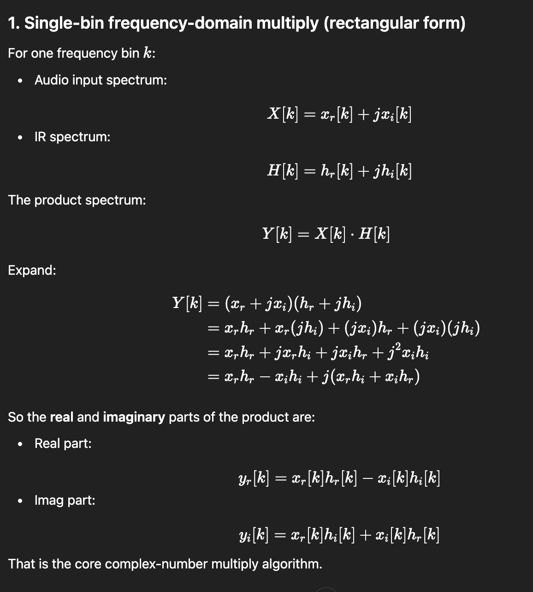

# FFT / IFFT Core Logic – Convolution Reverb  
**Presentation Notes**

1. IR preload
2. Partition create
3. FFT & IFFT convolution engine
4. Overlap-add

---

## 1. IR Side – FFT Usage in `IRLoader::loadIR`

### 1.1 Key Code Block

```cpp
for (int p = 0; p < numPartitions; ++p)
{
    std::vector<float> fftBuffer(static_cast<size_t>(fftSize * 2), 0.0f);
    const int offset = p * partitionSize;
    const int remaining = irLength - offset;
    const int copyCount = std::max(0, std::min(partitionSize, remaining));
    if (copyCount > 0)
        std::copy(monoIR.begin() + offset, monoIR.begin() + offset + copyCount, fftBuffer.begin());

    fft.performRealOnlyForwardTransform(fftBuffer.data());
    data->partitions[0][static_cast<size_t>(p)] = std::move(fftBuffer);
}
```


### 1.2 DSP Perspective

- The impulse response (IR) is divided into multiple blocks, called **partitions**.
- Each partition is copied into a temporary time-domain buffer `fftBuffer`.
- The remaining samples of `fftBuffer` are filled with zeros (**zero-padding**) so the total length equals `fftSize`.
- A real-only FFT converts each time-domain partition into its **frequency-domain spectrum**.
- Every partition’s spectrum is stored in `IRData::partitions[0][p]` as interleaved real and imaginary values.

After this pre-processing:

- The plugin holds `numPartitions` IR spectra.
- Each partition is ready for fast frequency-domain convolution during real-time audio processing.

### 1.3 C++ Perspective

- `std::vector<float> fftBuffer(fftSize * 2, 0.0f);`
  - Allocates a dynamic array of `float`s.
  - Length: `fftSize * 2` (JUCE’s real-only FFT uses `2 * fftSize` floats to store interleaved complex data).
  - All elements are initialized to `0.0f`.

- `offset`, `remaining`, `copyCount`:
  - `offset` marks the starting sample of the current partition in the mono IR.
  - `remaining` indicates how many samples are left from `offset` to the end of the IR.
  - `copyCount` clamps the number of samples to copy so it never exceeds `partitionSize` or `remaining`.

- `std::copy(monoIR.begin() + offset, monoIR.begin() + offset + copyCount, fftBuffer.begin());`
  - Copies `copyCount` samples from the IR into the front of `fftBuffer`.
  - The rest stays at `0.0f`, which forms the zero-padding region.

- `fft.performRealOnlyForwardTransform(fftBuffer.data());`
  - `fft` is a `juce::dsp::FFT` object configured with the proper FFT order.
  - `fftBuffer.data()` exposes the underlying raw pointer (`float*`) to the internal array.
  - The FFT operates **in-place**, replacing time-domain samples with interleaved complex frequency bins.

- `data->partitions[0][p] = std::move(fftBuffer);`
  - Transfers ownership of the buffer into the `IRData` structure.
  - `std::move` avoids copying the entire vector and only moves internal pointers and metadata.

---

## 2. Real-Time Side – `ConvolutionEngine::processChunk`

This function handles one **chunk** of input audio at a time:

1. Transform the input chunk into the frequency domain using FFT.
2. Combine it with all IR partitions using complex multiplication and accumulation.
3. Transform the result back to the time domain with IFFT.
4. Apply overlap-add and mix wet/dry signals.

### 2.1 FFT on the Input Chunk

```cpp
const int bins = fftSize / 2 + 1;

// Prepare input FFT buffer
std::fill(tempFreq.begin(), tempFreq.end(), 0.0f);
std::copy(samples + chunkOffset, samples + chunkOffset + chunkSize, tempFreq.begin());
fft->performRealOnlyForwardTransform(tempFreq.data());
```

#### DSP Perspective

- A portion of the input signal is selected: `chunkSize` samples starting at `chunkOffset`.
- This chunk is copied into the front of `tempFreq`.
- The rest of `tempFreq` is filled with zeros so the effective FFT length is `fftSize`.
- A real-only FFT converts the time-domain chunk into its complex spectrum `X[k]`.

#### C++ Perspective

- `tempFreq` is a `std::vector<float>` with length `2 * fftSize`.
- `std::fill(tempFreq.begin(), tempFreq.end(), 0.0f);`
  - Clears the buffer to a known state before writing new data.
- `std::copy(samples + chunkOffset, samples + chunkOffset + chunkSize, tempFreq.begin());`
  - Reads directly from the raw float pointer `samples` and writes into the vector.
- `fft->performRealOnlyForwardTransform(tempFreq.data());`
  - Executes the in-place FFT.
  - After the call, `tempFreq[2 * k]` contains the real part and `tempFreq[2 * k + 1]` contains the imaginary part of frequency bin `k`.

The spectrum is then stored in a per-channel ring buffer of input spectra:

```cpp
auto& channelSpectra = inputSpectra[static_cast<size_t>(channel)];
auto& writePos = writePositions[static_cast<size_t>(channel)];
channelSpectra[static_cast<size_t>(writePos)] = tempFreq;
```

- `inputSpectra` has three levels:
  - Level 1: channel index.
  - Level 2: partition index (ring buffer position).
  - Level 3: actual FFT data for that block.
- `auto&` creates references to avoid copying large containers.
- The current FFT result `tempFreq` is stored at the ring-buffer position `writePos`.

---

## 3. Frequency-Domain Convolution (Multiply–Accumulate Loop)

```cpp
std::fill(accumFreq.begin(), accumFreq.end(), 0.0f);
for (int p = 0; p < ir->numPartitions; ++p)
{
    const int idx = (writePos - p);
    const int inputIndex = (idx < 0 ? idx + ir->numPartitions : idx);
    const auto& X = channelSpectra[static_cast<size_t>(inputIndex)];
    const auto& H = ir->partitions[channelIndex][static_cast<size_t>(p)];

    for (int k = 0; k < bins; ++k)
    {
        const int bi = k * 2;
        const float xr = X[bi];
        const float xi = X[bi + 1];
        const float hr = H[bi];
        const float hi = H[bi + 1];

        accumFreq[bi]     += (xr * hr) - (xi * hi);
        accumFreq[bi + 1] += (xr * hi) + (xi * hr);
    }
}
```

<p align="center">
  
</p>

### 3.1 Ring-Buffer Alignment

- `writePos` is the index where the latest input FFT has been stored.
- The loop variable `p` corresponds to the IR partition index.
- `idx = writePos - p;`
  - Locates the input block that should align with IR partition `p`.
- When `idx` is negative, `idx + ir->numPartitions` wraps the index back into range.
  - This is classic **ring-buffer** behavior.
- `inputIndex` selects the correct historical input FFT from `channelSpectra`.

### 3.2 Complex Multiply and Accumulate

- `X` is the spectrum of a past input block.
- `H` is the precomputed spectrum of the IR partition.
- For each bin `k`:
  - `bi = 2 * k` is the index of the real part.
  - `bi + 1` is the index of the imaginary part.
- Real and imaginary components:
  - `X[k] = xr + j * xi`
  - `H[k] = hr + j * hi`

Complex multiplication formula:

\[
X[k] \cdot H[k] = (xr \cdot hr - xi \cdot hi) + j(xr \cdot hi + xi \cdot hr)
\]

Implementation:

- Real part:

  ```cpp
  accumFreq[bi] += (xr * hr) - (xi * hi);
  ```

- Imaginary part:

  ```cpp
  accumFreq[bi + 1] += (xr * hi) + (xi * hr);
  ```

- `accumFreq` acts as an accumulator over all partitions:
  - Each IR partition contributes to the final frequency-domain result for this chunk.
  - The entire loop implements **partitioned convolution in the frequency domain**.

---

## 4. IFFT, Scaling, and Overlap-Add

### 4.1 Inverse Transform and Scaling

```cpp
fft->performRealOnlyInverseTransform(accumFreq.data());
const float scale = 1.0f / static_cast<float>(fftSize);
```

- The inverse FFT converts the accumulated spectrum back into time-domain samples.
- The scaling factor `1.0f / fftSize` adjusts the amplitude according to the FFT/IFFT normalization convention.

### 4.2 Mixing Wet Signal with Overlap and Dry Input

```cpp
auto& overlap = overlapBuffers[static_cast<size_t>(channel)];
const float dryMix = 1.0f - wetMix;

for (int n = 0; n < chunkSize; ++n)
{
    const float wet = (accumFreq[n] * scale) + overlap[n];
    samples[chunkOffset + n] = outputGain * (wetMix * wet + dryMix * dryCopy[chunkOffset + n]);
}
```

- `accumFreq[n] * scale` provides the current block’s **wet** reverb samples.
- `overlap[n]` contains tail samples that were not output in previous chunks.
- The wet signal is combined with the overlap tail.
- `dryCopy[...]` stores the original input samples so the dry signal remains untouched by processing.
- `wetMix` and `dryMix` blend the two:
  - `wetMix` = proportion of reverb signal.
  - `dryMix` = proportion of original signal.
- `outputGain` applies a final linear gain after mixing.

### 4.3 Updating Overlap Buffer (Overlap-Add)

```cpp
if (chunkSize < fftSize)
{
    const int remain = fftSize - chunkSize;
    std::move(overlap.begin() + chunkSize, overlap.end(), overlap.begin());
    std::fill(overlap.begin() + remain, overlap.end(), 0.0f);

    const int tail = remain;
    for (int i = 0; i < tail; ++i)
        overlap[i] += accumFreq[chunkSize + i] * scale;
}
```

- The overlap buffer is shifted forward by `chunkSize` samples.
- The end of the overlap buffer is reset to zero after the shift.
- The tail of the IFFT result (`accumFreq[chunkSize ... fftSize - 1]`) is added into the front of `overlap`.
- On the next chunk, this stored tail is added to the newly computed samples, achieving seamless **overlap-add** reconstruction.

---

## 5. Big Picture Summary

### 5.1 IR Pre-Processing

- Load IR file → convert to mono.
- Choose a partition size based on the host buffer size.
- Split the IR into partitions and zero-pad each to `fftSize`.
- Perform FFT on every partition and store the spectra in `IRData`.

### 5.2 Real-Time Processing

For each audio block:

1. Break the block into smaller chunks of size `partitionSize` (or smaller at the end).
2. For each chunk:
   - Copy input samples into a temporary buffer and zero-pad.
   - Perform FFT to obtain the input spectrum.
   - Store the spectrum into a ring buffer.
   - For every IR partition:
     - Fetch the correctly aligned input spectrum from the ring buffer.
     - Multiply complex spectra and accumulate into `accumFreq`.
   - Perform IFFT on the accumulated spectrum.
   - Apply scaling, overlap-add, and wet/dry mixing.
   - Write the final processed samples back into the audio buffer.

### 5.3 C++ Design Patterns

- `std::vector<float>` used as flexible, resizable buffers for FFT data.
- `.data()` bridges C++ containers with APIs expecting raw pointers.
- `std::fill` and `std::copy` provide safe and readable buffer operations.
- `auto&` simplifies reference declarations and avoids copying.
- Manual complex arithmetic operates on interleaved real/imag arrays, which is efficient and cache-friendly.

These notes can be turned directly into slides by using each section or subsection as one or multiple slides, with the code snippets and bullet points as visual anchors during your explanation.
