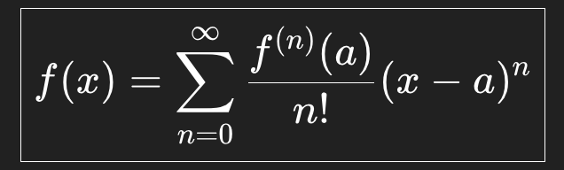

## Taylor Series Formula
The Taylor Series is a mathematical method that represents a smooth function as an infinite polynomial expansion. Instead of working with the original function—which might involve exponentials, trigonometric functions, or other complicated expressions—the Taylor Series approximates it using simple powers of (x−a).

    

    
</p