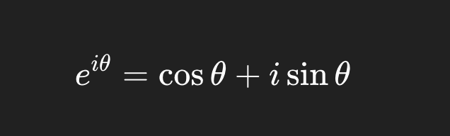
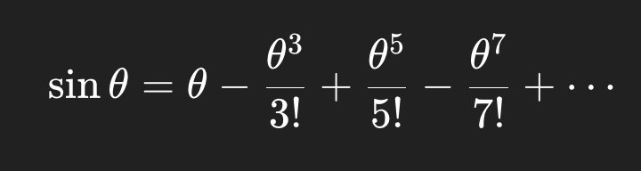
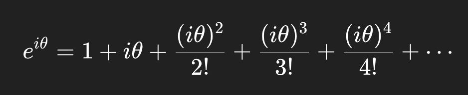
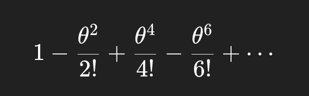
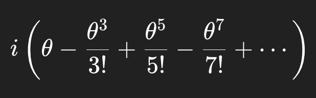

# 1. Project Overview - Convolution Reverb
This is an DSP plugin that can:
- Recreates the acoustics of a real space by applying its impulse response to the audio

Features:
- Full FFT/IFFT Formula coding, overlap-add buffer 
- DSP plugin
- GUI

Innovation/Interest:
- Learn FFT/DFT in DSP, learn the fundemental theory of Convolution Reverb

# 2. Technical Specification
JUCE Modules: 
- juce_core 
- juce_audio_basics 
- juce_audio_processors 
- juce_audio_devices 
- juce_audio_formats
- juce_gui_basics
- juce_gui_extra
- juce_audio_utils – for meters only

C++ features utilized:
- C++ features utilized
- Encapsulation & RAII

DSP algorithms to implement:
- FFT, IFFT
- Frequency-domain convolution - Complex multiply
- Overlap-Add (OLA)
- Zero-padding samples

Class hierarchy design
- ConvolutionReverbAudioProcessor (Owns DSP objects) - juce::AudioProcessor - [Implements] prepareToPlay, processBlock, releaseResources
- ConvolutionReverbAudioProcessorEditor (Owns GUI related)
- ConvolutionEngineBase - Pure DSP base for any convolution variant
- FFTProcessor, IRLoader, ImpulseResponse
- ParameterManager

Thread separation
- Audio Thread (Real-Time Processing Thread)
- Background Worker Thread (IR Loading & Preprocessing)(Offline)
- Message / GUI Thread (JUCE Message Thread)

Data flow diagram

- Audio Path (Real-Time):   
    ->  Host Audio Input  
    ->  Convolution Engine (FFT -> Multiply -> IFFT -> OLA)  
    ->  Dry/Wet Mix  
    ->  Host Audio Output

- Control / IR Loading Path (Non-Real-Time):    
    ->  User Load IR    
    ->  GUI Thread (FileChooser)    
    ->  Background Thread (Load IR + Preprocess + FFT partitions)   
    ->  Atomic Engine Swap  
    ->  Audio Thread Uses New IR    

Performance Requirements:
- Sample Rates: 44.1 kHz, 48 kHz
- Buffer Size:
    - 512 samples
    - 1024 samples
- Maximum acceptable latency: 10 ~ 20ms
- CPU usage: 371,000 per block(1024), 1.59 × 10⁷ FLOPs/sec

# 3. Scope Management
GOOD Outcome:
- Basic Audio routing system
- FFT/IFFT algorihm
- GUI designed

BETTER Outcome:
- Able to playback, mono.

BEST Outcome:   
- Partitioned convolution (small partitions for early reflections, larger for tail)
- SIMD/vectorization    
- Background threads for loading IR 
- vDSP / FFTW for faster FFTs   
- Lock-free ring buffers    

# 4. Implementation Plan
- As soon as possible

# 5. AI Collaboration Strategy
- Will consult AI about algorithm
- Give class arrange stratergy
- Debug
- I am documenting every knowledge I learned from AI including OLA buffer allocation, FFT algorithm

# 6. Risk Assessment
Technical Challenges:
- Difficult implement complex number calculation
- OLA - Overlap-Add implementation

Knowledge Gaps:
- DFT and FFT Theory
- Taylor Series Formula
- Euler’s Formula

# Additional Resource - Project workflow
1. Project setup
    - Create a ConvolutionReverb class
    - AudioProcessor holds one instance and calls it in prepareToPlay() and processBlock().

2. Data Structures
    - IR time-domain buffer

    - IR frequency-domain buffer (FFT)

    - FFT engine (juce::dsp::FFT, or another)

    - Temporary block buffer

    - Overlap-add buffer

    - Multiple partitions for partitioned convolution

3. Load IR file
    - Use AudioFormatReader to load a WAV/AIFF IR file.
    - Setup blocksize and fftSize.
    - Split IR into partitions (256-sample partitions)
    - Store them in an array: H_partition[p][k]

4. Pre-compute the FFT of IR
    - Allocate Frequency-domain IR buffer
    - Run FFT on the IR

5. prepareToPlay() Initialization

    Allocate:

    - inputBlockTimeDomain

    - inputBlockFrequencyDomain

    - outputFrequencyDomain

    - ifftTimeBuffer

    - overlapAddBuffer

    Clear all buffers.

6. processBlock(): Main Convolution Loop

    For each incoming audio block (e.g., 512 samples):
    - Copy input audio block
    - Zero-pad to fftSize
    - FFT the input block
    - Frequency-Domain Multiplication
    - IFFT - Convert back to time domain:
    - Overlap-Add

7. Wet/Dry Mix
8. Multichannel Handling
    - Run one convolution instance per channel

9. Optional Optimizations (if have enough time) (Advanced) !!!!!!

    - Partitioned convolution (small partitions for early reflections, larger for tail)
    - SIMD/vectorization
    - Background threads for loading IR
    - vDSP / FFTW for faster FFTs
    - Lock-free ring buffers

# Additional Resources: Theory
- Theory study was done before writing this proposal
- Below are so far what I understand

## Taylor Series Formula
The Taylor Series is a mathematical method that represents a smooth function as an infinite polynomial expansion. Instead of working with the original function—which might involve exponentials, trigonometric functions, or other complicated expressions—the Taylor Series approximates it using simple powers of (x−a).

    

## Euler’s Formula
Euler’s formula states:

    

We can prove this directly using the Taylor series expansions of the exponential, cosine, and sine functions.

By using Taylor Series:

    

    

    

We define the Imaginary number i: i^2 = -1 then,

    

Even-power terms (real):

    

This exactly matches the Taylor series of cos θ.

Odd-power terms (imaginary):

    

So the sum becomes: cosθ+i*sinθ

Then e^iθ = cosθ+i*sinθ

## DFT: Discrete Fourier Transform 
The Discrete Fourier Transform (DFT) converts a finite sequence of time-domain samples into an equivalent representation in the frequency domain. It decomposes a signal into a set of discrete frequency components, each with a magnitude and phase.

    

k = frequency index

n = time index

x[n] = the amplitude of the signal at time index 

The output of Descrete Fourier Transform gives us Phasing spectrum and Magnitude Spectrum. 

However, DST needs N^2 computation cost, but FFT makes it into N logN.

## FFT: Fast Fourier Transform
When 𝑁 is a power of 2 (e.g., 8, 16, 1024…), the DFT can be split into two parts:

(1) Even-indexed samples (2) Odd-indexed samples

From this separation, we obtain the key FFT relation:

    

𝐸
[
𝑘
]
E[k] = DFT of the even-indexed samples

𝑂
[
𝑘
]
O[k] = DFT of the odd-indexed samples

The total computation cost becomes: O(NlogN)